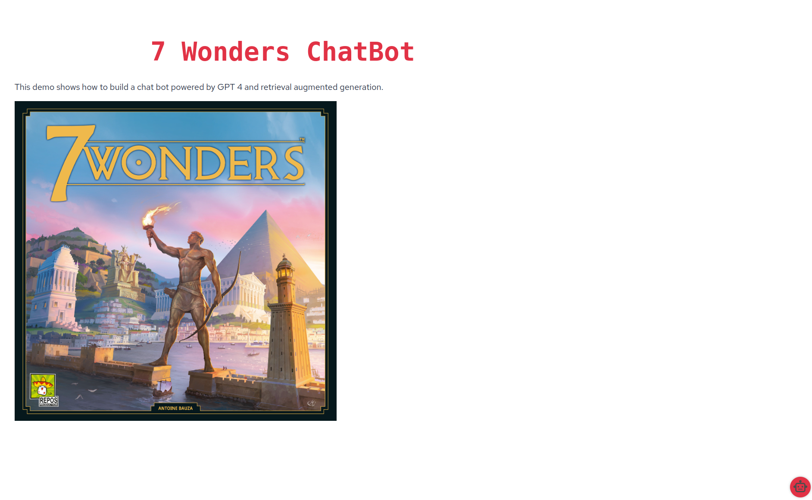

# Quarkus LangChain4j - 7 Wonders ChatBot

## Purpose

This sample application shows how simple it to build a chatbot that answers questions about the rules of the
popular [7 Wonders](https://boardgamegeek.com/boardgame/316377/7-wonders-second-edition) board game.

## Running the application

The only prerequisite to running the application is to have an [OpenAI API](https://openai.com/blog/openai-api) key.

The application can then run using:

```bash
QUARKUS_LANGCHAIN4J_OPENAI_API_KEY=mykey mvn quarkus:dev
```

This command will launch the application and ingest the official rules FAQs (which have been copied into this repo under `src/main/resources/data`). 

Once the application launches you should see 

The chat is launched By clicking the little robot in the bottom right corner.

## How it works

The application leverages the well known RAG (Retrieval Augmented Generation) pattern which the Quarkus LangChain4j
extension makes [trivial](https://docs.quarkiverse.io/quarkus-langchain4j/dev/easy-rag.html) to set up.
 


